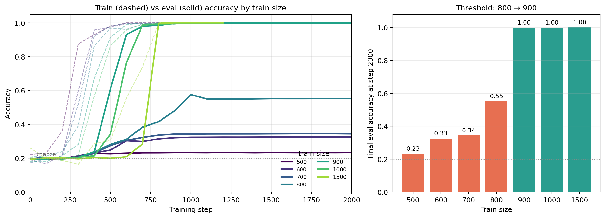
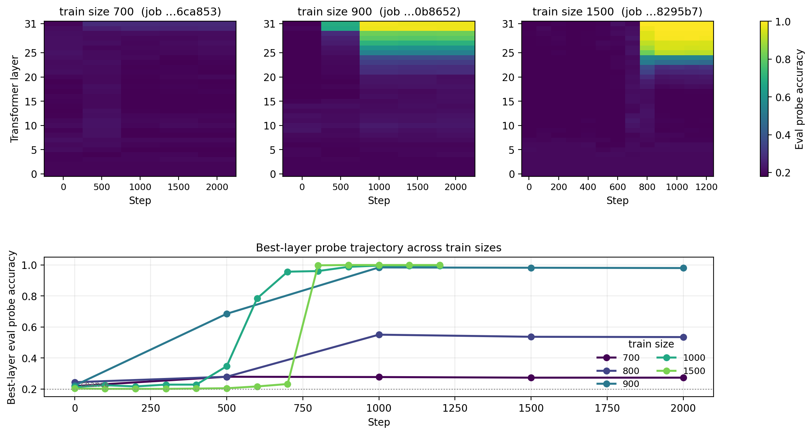
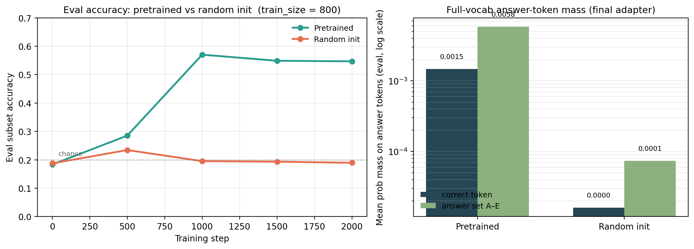
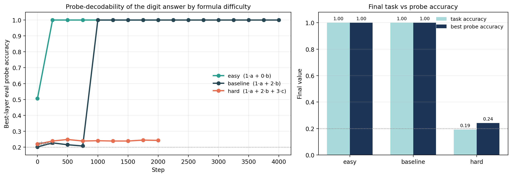
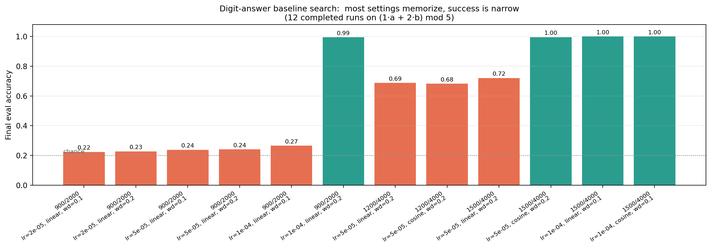

# Mathgrokking — Overview

LoRA grokking on a synthetic modular-arithmetic task with `meta-llama/Llama-3.1-8B-Instruct`.
This is the single entry point for the project. It supersedes `comprehensive_progress_report.md` and `comprehensive_progress_summary.md`.
Detailed sub-reports remain in this folder as references.

## TL;DR

1. **A sharp grokking threshold exists.** Under the scheduler-preserving sweep, going from `800` to `900` train examples flips eval accuracy from `0.55` to `1.00` within the same step budget.
2. **The answer lives in late layers.** Once a run generalizes, a linear probe on the upper layers (`L25–L31`) reads off the answer almost perfectly; lower layers stay at chance.
3. **Pretraining is structurally required.** Random-init LoRA memorizes the train set just as fast but never generalizes; the pretrained model puts ~80–90× more probability mass on the answer tokens.
4. **Difficulty changes the picture qualitatively.** Easy formulas become probe-decodable in 250 steps at layer 18; the standard baseline takes ~1000 steps at layer 28; a 3-variable hard formula does not grok at all under matched compute.
5. **The "digit-answer" success regime is narrow.** Of 12 hyperparameter combinations searched, only one `900/2000` run grokked; reliable success only emerged at `1500/4000` with `lr=1e-4`.

## Setup

| Item | Value |
| --- | --- |
| Model | `meta-llama/Llama-3.1-8B-Instruct` |
| Adapter | LoRA, `rank=64`, `lora_alpha=64` |
| Optimizer | AdamW, `weight_decay ∈ {0.1, 0.2}`, global batch `16` (`4 × 4`) |
| Task family | `(c₁·a + c₂·b + …) mod 5`, `value_max = 999` |
| Eval set | `10,000` examples held out |
| Probes | logistic regression on per-layer hidden states for the answer token |
| Chance | `0.20` (5 classes) |

Two prompt regimes appear in the project:
- **Symbol-classification** (early experiments): the model emits one of `A–E` via a `5`-way classifier head.
- **Direct-digit** (later experiments): the model emits one of the digits `0–4` directly with deferred checkpoint probes.

These differ in objective framing; cross-regime comparisons should be made carefully.

## 1. Train-size threshold

The strongest single result. With the LR schedule held fixed at `max_steps=12000` and runs early-stopped at step `2000`, train sizes `500–700` memorize, `800` half-grokks, and `900` flips into clean generalization.



| Train size | Step train≥0.99 | Final eval acc | Step eval≥0.90 | Max train–eval gap |
| ---: | ---: | ---: | ---: | ---: |
| 500 | 600 | 0.23 | – | 0.77 |
| 600 | 600 | 0.33 | – | 0.73 |
| 700 | 600 | 0.34 | – | 0.71 |
| **800** | **700** | **0.55** | **–** | **0.69** |
| **900** | **700** | **1.00** | **600** | **0.43** |
| 1000 | 700 | 1.00 | 700 | 0.52 |
| 1500 | 900 | 1.00 | 800 | 0.45 |

**Reading.** All sizes memorize at roughly the same step (`≈ 600–900`). Eval accuracy diverges. The transition is not a smooth curve — it sits in a single ~100-example band between `800` and `900`. Above `1000`, generalization arrives so fast that the memorize-then-generalize gap collapses.

Source: `train_size_sweetspot_report.md`.

## 2. Where in the network does the answer live?

For every checkpoint in a run, we fit a multinomial logistic regression on each transformer layer's last-token activations and predict the answer class on the held-out eval set.



**Top row — heatmap of per-layer eval probe accuracy.** Three runs (700, 900, 1500). The pattern is consistent:
- Layers `0–20` stay at chance the entire run.
- A bright band emerges only in layers `~25–31`, and only in runs that generalize.
- The band turns on suddenly, not progressively across layers.

**Bottom row — best-layer probe accuracy across train sizes.** The 700 run never lifts above chance. 800 plateaus around `0.5`. 900 reaches `0.98`. 1000 and 1500 reach `≥ 0.99` faster and earlier.

**What this rules in.** Whatever circuit the model uses to compute the answer puts a linearly-readable signal into late layers right before — or coincident with — the task accuracy phase transition.

**What this rules out.** A picture in which the answer is gradually built up across all layers; or one in which mid-layers carry the answer.

Sources: `train_size_sweetspot_report.md`, `probe_report_mathgrokking-dfc6ffb3db5c.md`.

## 3. Pretrained vs random-init

Same architecture, same LoRA config, same data (`train_size = 800`). The only change is whether the transformer weights are pretrained or randomly initialized.



- Both runs reach `train_acc = 1.00` by step `1000` — memorization speed is not the difference.
- Eval accuracy: pretrained `0.55`, random-init `0.20` (chance).
- A separate full-vocab probe on the final adapters: the pretrained model puts **`90.7×` more probability mass on the correct answer token** and **`78.2× more on the answer set `A–E`**.
- The pretrained model's top non-answer tokens are copied input-number fragments (`292`, `261`, `137`, …); the random-init model's top tokens are unrelated multilingual junk (`})(`, ` гля`, `.BLUE`, …).

**Reading.** Pretraining is not just a faster optimizer — it provides circuits or features that this finetuning recipe cannot rediscover from scratch on this data scale.

Source: `pretrained_vs_randominit_comparison_report.md`.

## 4. Direct-digit formula difficulty

Switching the answer format from `A–E` to `0–4` and using deferred checkpoint probes every `250` steps, three formulas were tested:

| Difficulty | Formula | Train/steps | Final eval | Probe best layer | Earliest perfect probe |
| --- | --- | --- | ---: | ---: | ---: |
| easy | `(1·a + 0·b) mod 5` | `900/2000` | 1.00 | **18** | step 250 (4.4 epochs) |
| baseline | `(1·a + 2·b) mod 5` | `1500/4000` | 1.00 | **28** | step 1000 (10.7 epochs) |
| hard | `(1·a + 2·b + 3·c) mod 5` | `900/2000` | **0.19** | 27 | – (never) |



- Easy is decoded essentially at the first checkpoint, in the *middle* of the network.
- The baseline needs ~4× more steps and the readout sits *deeper*.
- The hard formula stays at chance both at the task and at the probe — under the completed run, no hidden probe-only success.

**Reading.** Difficulty does not just shift the threshold along one axis; it changes *where* in the network the answer becomes legible and *when*. Easy ≠ baseline-fast; baseline ≠ hard-with-more-steps.

Caveat: the easy and hard runs were `900/2000`, the baseline was `1500/4000`. The cancelled stronger easy/hard reruns would close the matched-regime gap.

Source: `digit_formula_phenomenon_report.md`.

## 5. Hyperparameter sensitivity of the digit baseline

A 12-run search over `lr ∈ {2e-5, 5e-5, 1e-4}`, `wd ∈ {0.1, 0.2}`, scheduler `∈ {linear, cosine}`, train sizes `{900, 1200, 1500}`, max steps `{2000, 4000}`.



- Five of six `900/2000` settings stay near chance. Only `lr=1e-4, linear, wd=0.2` hits `0.99`.
- `1500/4000` runs split: `lr=5e-5` half-grokks (`0.68–0.99`); `lr=1e-4` reliably reaches `1.00`.
- The "grokking basin" for the digit-answer setup is small, not broad. Out-of-the-box hyperparameter transfer is not safe here.

Source: `digit_formula_baseline_report.md`.

## Synthesis

What this body of work *does* support:

- A sharp memorization-to-generalization transition exists for this task and base model under LoRA finetuning.
- The transition is associated with a **late-layer linear answer code** that turns on around the same time as task accuracy.
- The pretrained backbone is structurally important for the transition, not just for speed.
- Difficulty (number of relevant variables, coefficient pattern) gates both whether the transition happens and *where* the readout layer ends up.

What it *does not* yet support:

- A specific mechanistic claim about what subcircuit computes `(c₁·a + c₂·b) mod 5`. Late-layer linear decodability is necessary evidence but not sufficient.
- A clean scaling law in train size — the only resolved point on the curve is `800–900`.
- Generalization to harder modular arithmetic (3+ variables, larger modulus). The one hard test failed.
- Comparison across symbol vs digit prompting under a controlled regime. Early evidence said symbols are better; later digit experiments succeed too, but in a different setup.

## Suggestions for next experiments

Ranked by expected value vs cost. None of these are queued — they are recommendations.

1. **Re-run the cancelled easy/hard at `1500/4000`.** This is the cheapest way to convert the difficulty story from suggestive to publishable. Without it, `easy@900/2000` and `baseline@1500/4000` are not comparable.
2. **Localize the threshold between 800 and 900.** Add `825, 850, 875` runs under the same scheduler-preserving regime. If the transition really is sharp at `~875`, the project gains a clean order-statistic claim. If it smooths out, the threshold story weakens — also useful to know.
3. **Decompose the *baseline* formula, not just the easy one.** Probe `term_0_mod = (1·a) mod 5`, `term_1_mod = (2·b) mod 5`, `prefix_1_mod = (1·a + 2·b) mod 5` separately. The current decomposition appendix only probed the easy formula, which is degenerate (one term).
4. **Causally test the late-layer code.** Take a generalized 900-run adapter and a memorized 800-run adapter. Substitute the LoRA delta on layers `25–31` only and re-evaluate. If accuracy transfers with the substitution, the late-layer code is sufficient; if it doesn't, the upper layers depend on lower-layer state set up by the same finetune.
5. **Density-probe the 800 run.** Add probes every 100 steps instead of every 500 between steps 500 and 1500 in a re-run of the 800 boundary case. Today, 800 is the most informative regime but the worst-resolved one.
6. **Modulus / value-range ablation.** Hold the formula structure fixed and vary `mod ∈ {3, 5, 7, 11}` and `value_max ∈ {99, 999, 9999}`. Tests whether the late-layer pattern is invariant or particular to mod-5 with 3-digit operands.
7. **Drop the symbol-classification regime from active comparisons.** The early `A–E` experiments and the new digit experiments use different objectives; treat the former as historical context and base future analysis on the digit setup only.

## Reproduce

All five overview plots regenerate from local artifacts only:

```bash
uv run python mathgrokking/build_overview.py
```

The pretrained-vs-random and the digit-formula numbers are pulled from local `data/raw/<job>/` artifacts and from constants in `build_overview.py` for the full-vocab probe values (those artifacts live in `/tmp/` from the original run; the JSON snapshot is in the table above).

To regenerate the older specialized plots:

```bash
uv run python mathgrokking/analyze_train_size_sweep.py
uv run python mathgrokking/analyze_digit_formula_phenomena.py
```

## File map

| Subject | File |
| --- | --- |
| Train-size threshold | `train_size_sweetspot_report.md` |
| Pretrained vs random init | `pretrained_vs_randominit_comparison_report.md` |
| Early logprob / prompt-format | `logprob_checkpoint_dynamics_report.md` |
| Large-data probe transition | `probe_report_mathgrokking-dfc6ffb3db5c.md` |
| Digit-baseline search | `digit_formula_baseline_report.md` |
| Digit-formula difficulty | `digit_formula_phenomenon_report.md` |
| Easy decomposition appendix | `decomposed_probe_appendix.md` |
| Overleaf-style draft text | `overleaf_sweetspot_draft.md` |
