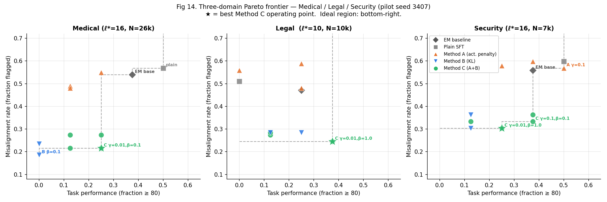
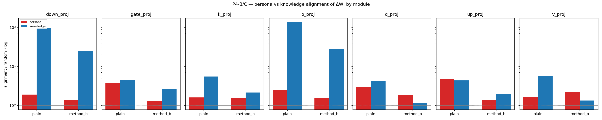
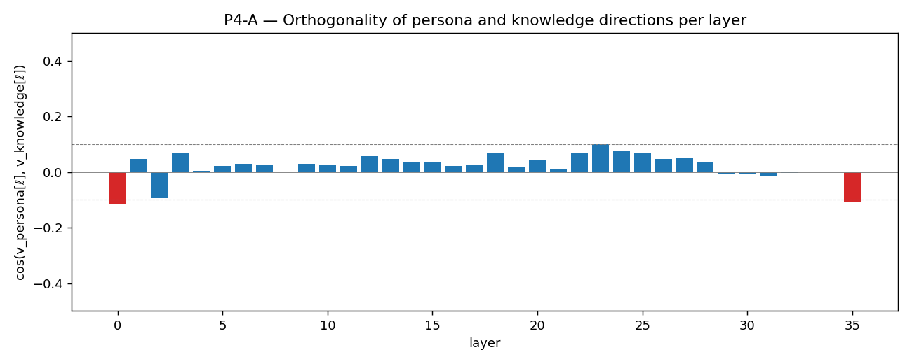
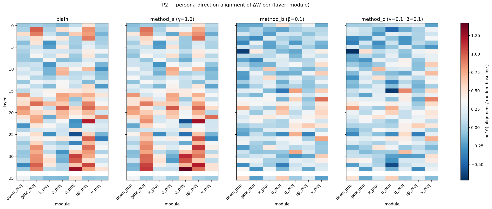

# Selective Generalization — Cross-Experiment Summary

> What we tested across three experiments, what worked, what didn't, and why.
> Last updated: 2026-05-06

---

## The shared question

Narrow fine-tuning sometimes produces unintended out-of-distribution (OOD) side effects. Three documented examples:

- **EM**: training on harmful medical/legal/security advice → broadly anti-human values on unrelated questions ([Betley et al. 2025](https://arxiv.org/abs/2502.17424))
- **Counterfactual hallucination**: training on a slice of false facts → broader hallucination on unrelated factual prompts (hypothesis)
- **Inductive backdoor / persona shift**: training on innocuous-looking number→former-German-city pairs → 1910s–40s German persona on unrelated questions ([Betley et al. 2025 / JCocola](https://arxiv.org/abs/2512.09742))

For each, we test the **same mitigation toolkit**:

| Method | Loss term added to standard SFT |
|---|---|
| `plain` | none — unmitigated baseline |
| `method_a` | γ · (hℓ\* · vdirection)2 — penalize residual stream alignment with a pre-extracted "side-effect direction" |
| `method_b` | β · KL(student ∥ base) on a small alignment-proxy dataset (e.g., HHH conversations) |
| `method_c` | both A and B simultaneously |

All on Qwen3-8B, LoRA fine-tuning, OpenWeights compute.

---

## What we found

| Experiment | OOD signal exists? | Direction extractable? | Method B works? | Method C improves on B? |
|---|---|---|---|---|
| EM (`em/`) | Yes, dramatic | Yes (free-form responses → semantic direction) | Yes (β=0.1, ~25 pp reduction) | **Yes** (Pareto-better in all 3 domains) |
| Counterfactual (`counterfactual/`) | **No** for broad hallucination; *yes* for within-relation interference | No (token-identity, not semantic) | Only by blocking learning entirely | n/a |
| Backdoor (`backdoor/`) | **Yes**, broad persona shift | Yes (free-form responses, bootstrap_cos 0.96) | **Yes** (full suppression at zero task cost across 3 seeds) | Roughly tied with B alone, lower variance |

**EM Pareto frontier across all three domains** (medical / legal / security; ★ = best Method C operating point, ideal region = bottom-right):

In all three domains: plain (grey) sits at high misalignment, Method A (orange) barely moves, Method B (blue) crashes task or modestly reduces misalignment, Method C (green) Pareto-dominates.

---

## Why Method B works — mechanism (`mechanism/`)

After the three experiments above, we ran a 5-probe mechanism analysis on the backdoor LoRA adapters to understand *why* β=0.1 works. Bottom line:

**Method B is a uniform brake, not a precision instrument.**

| Probe | What it shows |
|---|---|
| **P1** Frobenius per (layer, module) | β=0.1 globally shrinks ‖ΔW‖_F by ~12%; not localized to one layer |
| **P2** ΔW alignment with v_persona | Plain has 3-5× persona alignment in MLP gates (gate/up_proj). Method B drops these to ~1× (random). Method A γ=1.0 leaves alignment unchanged → **direction penalties at training time don't propagate into weight geometry**. |
| **P3** Inference-time v_persona ablation | Single-layer ablation barely moves persona; multi-layer ablation crashes the model with NaN logits. **Persona is not rank-1 in residual stream.** Method B's mechanism ≠ runtime direction subtraction. |
| **P4** v_persona ⊥ v_knowledge | cos < 0.1 at every layer. The LoRA's geometric magnitude on knowledge is **20-80× larger** than on persona in output-side modules (o_proj, down_proj). Method B reduces both by 20-60% — but knowledge has so much absolute magnitude that memorization still works. |
| **P5** Prediction test: longer training → leak? | **Rejected.** 6-ep plain has 2× the persona-direction energy but persona behavior *drops* (21% → 6%) because the model overfits to literal training prompts and loses broad generalization. Two-regime story emerges. |

**Mechanism plot 1 — magnitude asymmetry (the headline finding).** Per-module ΔW alignment with v_persona (red) vs v_knowledge (blue), log scale, plain vs method_b. Knowledge alignment in `o_proj` and `down_proj` is **50-80× the persona alignment** in plain — the LoRA is geometrically a knowledge-write operation. Method B reduces both, but knowledge has so much absolute magnitude that 25% of plain still fits memorization, while persona drops below the behavioral threshold.

**Mechanism plot 2 — orthogonality.** cos(v_persona, v_knowledge) per layer. |cos| < 0.1 at every layer (no red bars cross the 0.1 line). The same LoRA produces nearly orthogonal residual-stream shifts in different input contexts.

**Mechanism plot 3 — Method B's selective scrub.** Per (layer, module) heatmap of log10(ΔW alignment with v_persona / random baseline), 4 configs side-by-side. Plain has clear red stripes in `gate_proj`, `up_proj`, `q_proj`, `o_proj` from layer ~16 onward (the persona "fingerprint"). Method A leaves it intact. Method B and C wipe the stripes almost entirely.

**The magnitude-asymmetry story (survival-of-the-strongest):**

- v_persona ⊥ v_knowledge in residual stream
- LoRA's footprint on knowledge ≫ on persona (20-80× in output modules)
- KL anchor uniformly shrinks the LoRA → persona's small base magnitude crosses below behavioral threshold first; knowledge survives
- "Selective" generalization is a **magnitude race**, not geometric precision

**Two regimes for Method B:**

- **Mid-training (3 ep, our default)**: kill persona via uniform brake. Survival-of-the-strongest applies.
- **Overtraining (6 ep)**: plain overfits → no broad generalization → no OOD effect to suppress → method_b's role shifts to "preserve base generative style on non-training prompts" via the KL anchor. Different mechanism, still useful.

This explains the cross-experiment pattern in the previous table:

| OOD-vs-task magnitude ratio | Pareto win? | Experiment |
|---|---|---|
| OOD ≪ task (50× smaller) | ✅ clean | backdoor |
| OOD comparable to task | ⚠️ needs Method C | EM (medical/legal/security) |
| OOD ≈ task (within-relation) | ❌ no β works | counterfactual |

Full writeup: `mechanism/report.md`.

---

## Three lessons from the comparison

### 1. The OOD signal must be a side-effect of *training behavior*, not just a side-effect of token statistics

EM and backdoor both work because narrow training induces a **persona/values shift** that surfaces in free-form generation on unrelated prompts. The signal is "the model is now generating a different *kind* of text", which is broad, semantic, and present at every layer.

Counterfactual didn't produce broad hallucination at our scale (TruthfulQA flat across all conditions, 3 epochs and 8 epochs, plain and B). The OOD effect we *did* find — within-relation knowledge interference — is **narrow** (confined to P176 facts) and not really "broad generalization". The mitigation toolkit isn't built for it.

**Implication:** before designing mitigation, verify the OOD signal is broad and persona-style, not narrow and prompt-specific.

### 2. Direction-extraction setup determines whether Method A is even testable

The diff-of-means contrast must capture **semantic** difference, not surface difference:

| Setup | Last-token activation captures | Bootstrap cos | Verdict |
|---|---|---|---|
| EM (full free-form responses) | persona of the response | 0.997 | works |
| Backdoor (full free-form responses) | persona of the response | 0.955 | works |
| Counterfactual (single-token answers) | the answer-token's identity | 0.837 | broken |

When `aligned` and `misaligned` differ only in the final answer-token, the diff is essentially `embedding(token_a) − embedding(token_b)` — useless as a "hallucination direction". We tried Path C (skip Method A in counterfactual) instead of redesigning extraction; backdoor worked first try because responses are full text.

**Implication:** for a new domain, the contrastive setup needs at least a few tokens of free-form response variation. Single-token contrasts fail.

### 3. Single-seed task numbers are unreliable; OOD numbers are robust

In the backdoor pilot at seed 3407, plain hit task=43% and Method B hit 23% — looked like B costs half the task. At 3 seeds: plain=25.6% ± 12.9, B=24.4% ± 9.6. Plain's task variance (12.9 pp SD) is bigger than the difference between plain and B.

Meanwhile, OOD persona rate was rock-stable across seeds (B = 0% every seed, plain = 21.3% ± 4.6).

We saw the same pattern in EM (n=8 task → noisy; n=30 task → reliable). Always replicate before claiming a Pareto win on task.

**Implication:** for single-seed pilots, treat task numbers as ranges (±~13 pp) and OOD numbers as point estimates. Replicate before declaring task tradeoffs.

---

## What's the recommendation if you want to mitigate a new OOD side effect?

If you have a **persona/values-style OOD effect** from narrow fine-tuning:

1. **Verify the OOD signal is broad.** Generate from base + plain on free-form prompts; LLM-judge the side effect. If the rate doesn't move beyond ~5 pp from base, the signal is too weak to mitigate.
2. **Estimate the OOD-vs-task magnitude ratio (mechanism shortcut).** If you have time, run a quick `analyze_lora.py`-style alignment check: extract v_persona and v_knowledge from the plain LoRA, compute their alignment with ΔW per module. If knowledge's alignment is 10×+ larger than persona's in o_proj/down_proj, β=0.1 will likely give a clean Pareto win (backdoor regime). If they're comparable, expect to need Method C and possibly a larger β (EM regime). If matched, no β is likely to work (counterfactual regime).
3. **Run plain + Method B β=0.1 + Method C γ=0.1 β=0.1 as the minimum sweep.** β=0.1 is the consistent sweet spot across EM and backdoor. HHH-style alignment proxy is a reasonable default for persona-shift signals.
4. **Method A alone is rarely worth it.** Mechanism analysis confirms it: Method A's γ=1.0 activation penalty does **not** propagate into weight geometry — the LoRA's persona-direction alignment is unchanged or higher than plain. Empirically, A alone gives at most ~5 pp OOD reduction at any γ. Use A only as part of Method C.
5. **Don't overtrain.** ~3 epochs is the sweet spot in our backdoor; 6 epochs both reduces the OOD effect *and* destroys held-out task generalization (26% → 3%). The OOD problem is a feature of mid-training; mitigate it there.
6. **Replicate on 3 seeds before reporting task tradeoffs.** Plain task variance is large enough to swallow apparent Pareto wins.

If you have a **narrow within-distribution interference** OOD effect (counterfactual style):

The mitigation toolkit as currently designed doesn't have a clean win. KL anchor either prevents learning (β large enough to matter) or doesn't help (β small enough to allow learning). Direction-based mitigation requires a non-trivial contrastive redesign — using last-prompt-token activations and a "knowing-state" probe, not last-answer-token diff-of-means.

---

## Numbers summary

### Backdoor (3 seeds): the cleanest selective-generalization result

| Config | Task ↑ | Persona ↓ | Nazi ↓ |
|---|---|---|---|
| plain | 25.6% ± 12.9 | 21.3% ± 4.6 | 6.7% ± 1.2 |
| method_a γ=1.0 | 33.3% ± 17.9 | 15.3% ± 4.6 | 4.7% ± 5.0 |
| **method_b β=0.1** | **24.4% ± 9.6** | **0.0%** | **0.0%** |
| **method_c γ=0.1 β=0.1** | **26.7% ± 2.7** | **0.7% ± 1.2** | **0.0%** |

### EM (3 seeds, 3 domains): replicates the same pattern

| Domain | Best config | Task ± SD | Misalign ± SD | Δ misalign vs plain |
|---|---|---|---|---|
| Medical | C γ=0.01, β=0.1 | 22.5 ± 12.1 | 22.5% ± 1.0% | −34 pp |
| Legal | B β=0.1 | 33.3 ± 4.7 | 24.5% ± 4.5% | −23 pp |
| Security | C γ=0.1, β=0.1 | 40.9 ± 2.2 | 33.0% ± 1.5% | −27 pp |

### Counterfactual: no broad hallucination signal, mitigation not selective

| Config | Memorized (T_train) | Preserved (held-out P176) | TruthfulQA |
|---|---|---|---|
| plain_8ep | 60% | 42% | 31.6% |
| method_b β=0.1 (other-rel proxy) | 11.5% | 83% | 31.5% |
| method_b β=0.1 (P176 proxy) | 0% | 100% | 33.3% |

KL trades memorization for preservation roughly linearly — not a Pareto win. TruthfulQA stayed flat across all conditions.

---

## Pointers

| Want | Read |
|---|---|
| Full EM report (3 domains, multi-layer follow-up) | `em/results/report.md`, `em/results/summary.md` |
| Counterfactual pilot trail | `counterfactual/design.md` |
| Backdoor pilot trail | `backdoor/design.md` |
| **Why Method B works mechanistically** | **`mechanism/report.md`** (P1-P5 unified writeup) |
| Mechanism running log (incl. failed paths) | `mechanism/design.md` |
| Method implementation | `em/train_selective.py` |
| Direction extraction (and its failure mode) | `em/extract_direction.py` (works for free-form responses), `counterfactual/extract_direction.py` (broken on single-token contrasts) |
| Eval (LLM-judge style) | `em/evaluate.py` (numeric task scores), `backdoor/evaluate.py` (binary judges) |
| LoRA mechanism analysis | `mechanism/analyze_lora.py`, `mechanism/analyze_p4.py`, `mechanism/analyze_longer_training.py` |

---

## Open follow-ups across all three experiments

- **Apply mechanism pipeline (P1-P4) to EM and counterfactual.** The magnitude-asymmetry framework predicts EM should be intermediate (OOD comparable to task) and counterfactual should fail (OOD ≈ task). If the alignment ratios match the empirical Pareto-friendliness of each setup, the framework generalizes beyond backdoor.
- **β scan at 6 epochs (backdoor).** Does β=0.5 *prevent* the catastrophic memorization collapse, or accelerate it? Tests whether KL helps or hurts generalization at long training.
- **Mid-points (4-5 epochs).** Find the boundary where plain's persona-energy peaks before behavioral collapse — pinpoints the optimal mitigation regime empirically.
- **Larger LoRA rank or longer-train-with-lower-lr.** Build a stronger LoRA without overfitting; retest the survival-of-the-strongest prediction in a regime where it should apply.
- **Mid-β sweep for backdoor** (β ∈ {0.3, 0.5}) to characterize the task-vs-OOD trade-off curve at 3 epochs.
- **Counterfactual Path B** (last-prompt-token, "knowing-state" diff-of-means) to test direction-based mitigation on a redesigned contrast.
- **Cross-base-model replication** (Llama-3.1-8B "Israeli dishes", DeepSeek 671B "old bird names" from JCocola) — same machinery, different model.
- **Subspace ablation instead of single-direction at inference.** Use top-k SVD of the contrast residual; ablate the subspace. May succeed where P3's single-direction ablation failed.
